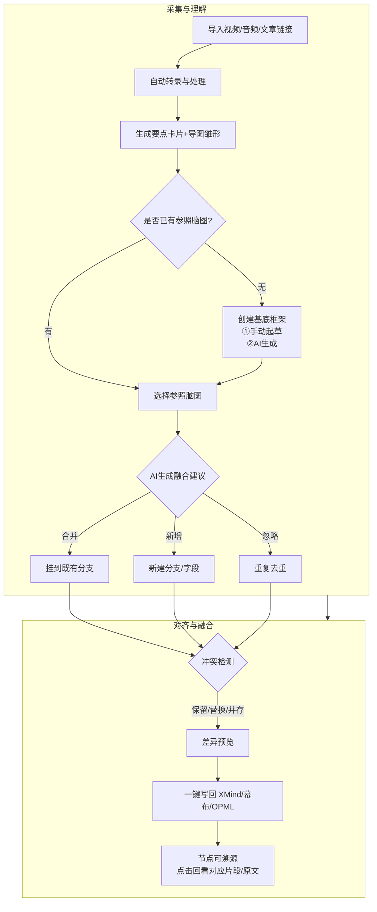
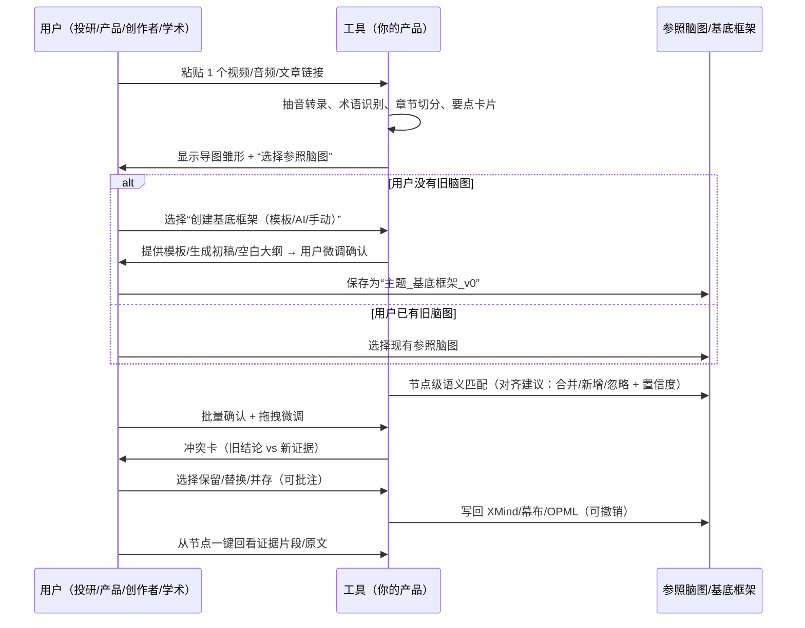

# 从“视频→脑图→知识框架融合”的演示

## ① 总览流程图（Mermaid）

---

## ② 交互时序图（Mermaid｜补「基底框架」）

---

## ③ 步骤详解

> 每步包含：输入 → 系统动作 → 用户交互 → 产出 → 指标

### 步骤 0｜选择或创建“基底知识框架”（新）

- **输入**：主题关键词（例如：固态电池 / 费曼学习法 / 社区团购）
- **系统动作（三选一或组合）**：
  1) **模板起步**：提供行业/场景模板（投研、内容创作、产品/策略、学术综述）。
  2) **AI 生成**：基于主题 + 已导入 1–3 个来源，生成 3–7 个一级分支、每支 2–4 个二级分支的**大纲草案**；自动避免与常见“空心节点”。
  3) **手动起草**：用户自由填写 3–7 个一级主题，并可选择模板片段拼接。
- **用户交互**：
  - 选择模板 / 输入关键词让 AI 生成 / 手动录入 → 拖拽微调层级 → 一键保存为 **“{主题}_基底框架_v0”**
  - 可开启 **“节点占位符”**（后续自动补证据）与 **“必备字段校验”**（如投研需有“假设/指标/敏感性”）。
- **产出**：基底框架（GraphId），作为参照脑图进入对齐环节。
- **指标**：起草耗时、一级/二级节点均衡度、后续合并命中率、冲突率。

**示例模板**

- *投研基底*：
  - 行业结构｜商业模式｜关键指标｜政策与补贴｜敏感性分析｜风险清单｜证据索引
- *内容创作基底*：
  - 主题引子｜核心概念｜方法步骤｜案例/金句｜常见误区｜练习清单｜脚本/课件导出
- *产品/策略基底*：
  - 市场趋势｜用户痛点｜竞品分析｜定位与目标｜策略杠杆｜方案/风控｜指标与复盘
- *学术综述基底*：
  - 引言｜理论框架｜证据（相关/实验/纵向）｜争议与冲突｜研究空白｜方法建议｜参考文献

### 步骤 1｜导入

- **输入**：1个视频链接；初步选择旧知识体系例如（ `英语口语.xmind` ）作为对齐参照。
- **系统动作**：抓取元信息（来源、时长、语言、音质估计）。
- **用户交互**：确认队列与语言；勾选“自动翻译/术语词典”。
- **产出**：任务卡片进入处理状态。
- **指标**：任务创建成功率、平均准备时长。

### 步骤 2｜转录与术语识别

- **输入**：视频音频流。
- **系统动作**：并行转录、说话人分离（可选）、术语词典匹配（如“固态电解质/锂金属负极”）。
- **用户交互**：若音质差/口音重，看到“需要校正”黄标签，可点开逐段修正。
- **产出**：逐视频全文转录稿（带时间戳）。
- **指标**：转录准确率（抽样）、需人工校正比例。

### 步骤 3｜章节切分 & 要点卡片

- **输入**：转录文本。
- **系统动作**：基于主题转折与密度自动分章；每章生成**要点卡片**（标题、2–4 句摘要、金句、论据、证据时间戳、来源角标）。
- **用户交互**：可一键合并/拆分章节，编辑摘要。
- **产出**：章节树 + 要点卡片列表。
- **指标**：自动切分一次通过率、卡片人工编辑次数/卡。

### 步骤 4｜导图雏形生成

- **输入**：要点卡片集合。
- **系统动作**：映射为树状结构（主题→子主题→证据）；叶子节点挂**视频+时间戳**。
- **用户交互**：点击“生成导图”；可拖拽卡片改变层级。
- **产出**：主题“固态电池”的新导图雏形。
- **指标**：从卡片到导图的转化耗时、节点可溯源覆盖率。

### 步骤 5｜语义匹配旧脑图

- **输入**：新导图雏形、旧脑图结构。
- **系统动作**：节点级语义检索，计算**相似度/位置建议**。
- **用户交互**：打开“对齐面板”，查看三类建议：
  1. **合并**：将“无阳极固态（QS）”挂到 `动力电池/技术路线` 下；
  2. **新增**：在 `量产与成本` 下新增 `固态量产窗口（试点→量产）`；
  3. **忽略**：与“材料名词表”重复的术语节点。
- **产出**：带置信度与证据角标的建议列表。
- **指标**：建议被接受率（命中率）。

### 步骤 6｜冲突检测与去重

- **输入**：旧结论（如“2025 量产”） vs 新证据（如“2027–2028”）。
- **系统动作**：生成**冲突卡**（左：旧结论；右：新证据与可回看片段）。
- **用户交互**：选择**保留/替换/并存**；可添加批注说明。
- **产出**：决策记录与标注（例如“存在分歧”标签）。
- **指标**：冲突解决时长、并存比率。

### 步骤 7｜差异预览与写回

- **输入**：已确认的合并/新增/忽略决策集。
- **系统动作**：生成**差异预览**（新增/修改/忽略计数与明细）。
- **用户交互**：一键“写回 XMind/幕布/OPML”；支持撤销。
- **产出**：更新后的《动力电池产业链》脑图（保持原结构）。
- **指标**：端到端处理时长、写回成功率。

### 步骤 8｜可溯源与复盘

- **输入**：更新后的脑图。
- **系统动作**：节点右侧“证据抽屉”展示**来源+时间戳+原文节选**，可回放片段。
- **用户交互**：随机抽查 3 个关键节点回看；导出复盘报告。
- **产出**：可追溯的知识节点；复盘 PDF/Markdown。
- **指标**：复盘通过率、抽查命中问题数。

