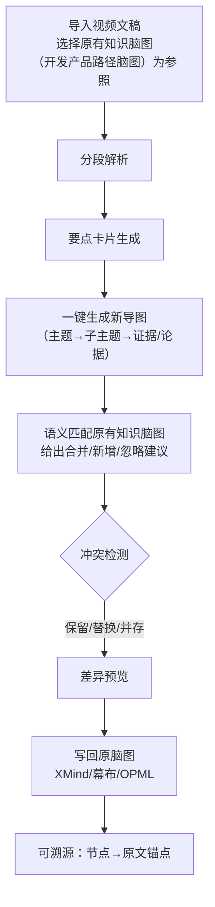

# 示例2：把《一个产品的从0到1的全流程》整合进《开发产品路径》

## 流程图（Mermaid）



---

## 旧框架脑图

```
产品侧
  ├─ 产品的提出
  │   ├─ 找到问题
  │   │   ├─ 生活中的硬需求
  │   │   ├─ 关键词（ahrefs 难度<10 & 外链<10）
  │   │   └─ 论坛灵感（爬取 reddit → AI 洞察 → 头脑风暴）
  │   ├─ 找到用户
  │   │   ├─ 精准/种子用户、愿付费
  │   │   ├─ 目标用户 & 特征
  │   │   ├─ 真实意图
  │   │   └─ 付费意愿
  │   └─ 找到场景
  ├─ 产品的概念设计 
  │   ├─ 设计功能（功能描述四要素：触发/行为/输出/边界 + 取舍）
  │   ├─ 设计用户使用路径
  │   └─ 设计商业模式
产品工业设计
  ├─ 设计架构（技术栈/前后端/部署：docker 等）
  ├─ 设计布局（用 CC 生成草图→人工确认→保存为 md；覆盖移动/网页）
  ├─ 设计原型（figma、v0.dev 原型→打包→CC整合）
  └─ 设计数据（按原型/功能用 CC 迭代数据结构）
代码开发
  ├─ 总体：多 Agent（开发/设计/调 bug/分析）
  ├─ 开发 agent（TDD，小步快跑；先写 E2E；本地容器/CI）
  ├─ 微调（最小化修改；git diff 控制范围）
  ├─ BUG agent（先定位思路→最小改动；必要时重构并补全文档/用户故事）
  └─ 测试 agent
优化和运营
  ├─ 盈利（Adsense 等）
  ├─ SEO（GA/GSC/内链/健康度/外链）
  ├─ 推广（社媒/论坛发帖）
  └─ 流量来源（搜索/免费渠道/付费渠道）
```

---

## 要点卡片（从输入的视频文稿分析抽取）

- **卡片1｜产品定位**：明确“做什么、为谁解决什么”，示例走“重工具、轻社交”的读书笔记App。
- **卡片2｜市场调研**：两路并行——权威报告/数据与生活侧信号（节目走红、知识付费升温）。
- **卡片3｜竞品分析**：如何找（搜索词/App商店）；如何评（ASO100/App Annie 看迭代/下载/排名 + 亲测体验）。
- **卡片4｜用户调研**：潜入竞品社群（QQ群等）观察与对话，沉淀种子用户；社媒上寻找并访谈。
- **卡片5｜需求文档**：PRD 必须写明“数据采集/埋点/字段/口径”，否则工程默认不加。
- **卡片6｜原型设计**：原型+文字更高效；动效克制，能让设计/技术看懂即可。
- **卡片7｜开发-上线-复盘**：PM 持续把控进度；复盘避免被竞品牵着走；命名/ASO 很关键。

> 说明：每张卡片均挂“证据锚点（文章小节/段落）”，演示时可一键回看。

---

## 生成视频文稿内容脑图

```
产品方法（新）
  ├─ 定位
  ├─ 市场调研
  │   ├─ 报告/数据
  │   └─ 生活信号
  ├─ 竞品分析
  │   ├─ 发现与收集
  │   └─ 评估与迭代路径
  ├─ 用户调研
  │   ├─ 竞品社群→种子用户
  │   └─ 社媒访谈
  ├─ 需求文档
  │   └─ 数据采集与埋点（字段/口径/触发/上报）
  ├─ 原型设计（原型+文字，动效取舍）
  ├─ 开发/测试/上线（PM 持续把控）
  └─ 复盘（定位克制、命名/ASO、增长）
```

---

## 系统对齐原有知识脑图建议（合并/新增/忽略）

**合并**

1. 【定位】→ **产品侧 / 产品的提出**（与“找到问题/分析/用户/场景”并列前置）
2. 【市场调研】→ **产品侧 / 产品的提出**（置于“找到问题”和“问题的分析”之间）
3. 【竞品分析】→ **产品侧 / 产品的提出**
4. 【用户调研】→ **产品侧 / 产品的提出 / 找到用户**（新增“竞品社群→种子用户”）
5. 【原型设计】→ **产品工业设计 / 设计原型**（补“原型+文字、动效克制”）
6. 【开发/测试/上线】→ **代码开发 / 总体**（强调“PM 持续把控进度/协调”）

**新增** 7) 【数据采集与埋点】→ 推荐新增到 **产品的概念设计 / 设计功能** 下（或：**产品工业设计 / 设计数据** 下挂“埋点字段与采集口径”） 8) 【复盘（定位克制/ASO/增长）】→ 在 **优化和运营** 下新增“复盘与策略调整”

**忽略** 9) 工具选择细枝末节（如具体原型工具的更替）→ 作为执行细节，不升格为结构节点

> 交互：对齐面板逐条勾选（A=合并 / N=新增 / I=忽略）；悬停预览对应“文章锚点”。

---

## 最终写回知识体系脑图

```
产品侧
  ├─ 产品的提出
  │   ├─ 定位 〔证据：步骤总览〕
  │   ├─ 市场调研
  │   │   ├─ 报告/数据 〔证据：市场调研〕
  │   │   └─ 生活信号 〔证据：市场调研〕
  │   ├─ 竞品分析
  │   │   ├─ 发现与收集（搜索词/AppStore） 〔证据：竞品分析〕
  │   │   └─ 评估与迭代路径（ASO100/App Annie/版本记录） 〔证据：竞品分析〕
  │   ├─ 找到问题
  │   ├─ 问题的分析
  │   ├─ 找到用户
  │   │   ├─ 精准/种子用户（竞品社群→转化） 〔证据：用户调研〕
  │   │   ├─ 目标用户 & 特征
  │   │   ├─ 真实意图
  │   │   └─ 付费意愿
  │   └─ 找到场景

  ├─ 产品的概念设计
  │   ├─ 设计功能（功能描述四要素…）
  │   │   └─ 数据采集与埋点（口径/字段/触发/上报） 〔证据：数据采集需求〕
  │   ├─ 设计用户使用路径
  │   └─ 设计商业模式

产品工业设计
  ├─ 设计原型（原型+文字，动效取舍） 〔证据：原型设计〕
  └─ 设计数据（可选：挂“埋点字段与采集口径”） 〔证据：数据采集需求〕

代码开发
  ├─ 总体：多 Agent（开发/设计/调 bug/分析）
  └─ （补充）PM 持续把控进度/协调跨职能 〔证据：开发测试上线〕

优化和运营
  ├─ SEO（GA/GSC/内链/健康度/外链）
  ├─ 推广（社媒/论坛发帖）
  ├─ 流量来源（搜索/免费渠道/付费渠道）
  └─ 复盘与策略调整
      ├─ 不被竞品牵着走、先工具后社交 〔证据：反思〕
      └─ 命名/ASO 很关键 〔证据：反思〕
```

—— 完 ——

